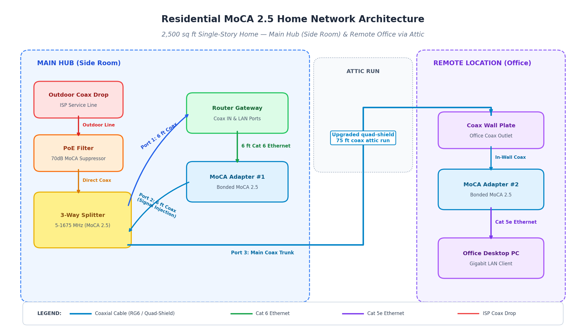

# Residential MoCA 2.5 Network Upgrade
July 2026

*Replaced a failing Wi-Fi extender link to a home office with a wired Multimedia over Coax (MoCA) bridge. Took a workstation from <10 Mbps with constant dropouts to a stable 700 Mbps connection for $152 in parts. Installation required troubleshooting to isolate a signal degradation point in the legacy dual-shield attic coax run and fishing a new quad-shield RG6 cable to eliminate points of failure.*

## Overview

- **Goal:** The office workstation on the far side of the house was relying on an extended 2.4 GHz Wi-Fi signal and getting under 10 Mbps with frequent dropouts, despite the home having gigabit Xfinity service at the modem. Fix the bottleneck without running new Ethernet through finished walls.
- **Strategy:** Use the home's existing coax infrastructure as a wired Ethernet bridge (MoCA 2.5) instead of relying on Wi-Fi range.
- **Scope:** 2,500 sq ft single-story home, main hub in the living room, target office at the far end of the house via an attic coax run.
- **Result:** Delivered a stable, low-latency, gigabit connection with download speeds up to 700 Mbps.

## Architecture

<table style="border-collapse: collapse; width: 100%;">
  <tr>
    <td style="border: 1px solid #d0d7de; padding: 8px;"><b>Property Size</b></td>
    <td style="border: 1px solid #d0d7de; padding: 8px;">2,500 sq ft (single-story with attic)</td>
    <td style="border: 1px solid #d0d7de; padding: 8px;"><b>Point of Entry (PoE)</b></td>
    <td style="border: 1px solid #d0d7de; padding: 8px;">Living Room (outdoor coax junction)</td>
  </tr>
  <tr>
    <td style="border: 1px solid #d0d7de; padding: 8px;"><b>Primary Hub</b></td>
    <td style="border: 1px solid #d0d7de; padding: 8px;">Living Room (Arris router & MoCA #1)</td>
    <td style="border: 1px solid #d0d7de; padding: 8px;"><b>Remote Target</b></td>
    <td style="border: 1px solid #d0d7de; padding: 8px;">Office Desktop PC (far side of house)</td>
  </tr>
  <tr>
    <td style="border: 1px solid #d0d7de; padding: 8px;"><b>Coax Distribution</b></td>
    <td style="border: 1px solid #d0d7de; padding: 8px;">3-way MoCA splitter (5–1675 MHz)</td>
    <td style="border: 1px solid #d0d7de; padding: 8px;"><b>Backbone Media</b></td>
    <td style="border: 1px solid #d0d7de; padding: 8px;">Attic RG6 coaxial cable run</td>
  </tr>
</table>

## Materials

| **COMPONENT** | **PURPOSE** | **COST** |
| --- | --- | --- |
| Hitron HTEM4 (MoCA 2.5) Adapters (2-pack) | Inject Ethernet signal into existing home cable infrastructure | $105 |
| 75 ft RG6 quad-shield in-wall coaxial cable | Upgraded attic backbone | $22 |
| Point of Entry (PoE) coax filter | Prevents MoCA signal leakage | $10 |
| 3-way coax splitter (5-1675 MHz) | Upgraded high-frequency MoCA pass-through | $8 |
| Cat5e Ethernet and RG6 patch cables | Device interconnects | $7 |
| Astro AI digital clamp multimeter | Locate the attic end of the office coax by testing line continuity | |
| | **TOTAL COST** | **$152** |

## Method

### Phase 1: Continuity testing of the existing home coaxial infrastructure

- Traced the 27-year-old RG6 coax run from the living room hub into the attic and back down into the office.
- Applied an aluminum foil short across the office F-connector to create a closed loop, using a multimeter to confirm line continuity.
- Replaced outdated 1000 MHz splitters with a 1675 MHz MoCA-compatible splitter.

### Phase 2: Signal Degradation Diagnosis

- Connected MoCA Adapter #1 at the living room hub.
- Tested MoCA Adapter #2 incrementally at the attic junction versus the end of the long office run to verify signal continuity.
- **Troubleshooting Finding:** Identified that legacy **dual-shield** RG6 cable and high-attenuation barrel connectors caused total MoCA signal loss across the 75 ft run.

### Phase 3: Cable Pull & Infrastructure Upgrade

- Eliminated two intermediate barrel connectors by pulling a single, continuous 75 ft RG6 **quad-shield** cable from the living room splitter directly to the office wall plate.
- Attached the new cable to the old one with a flush-taped F-type coupler to fish the new line across the attic and down through the office wall without snags.

## Skills Demonstrated
- **Problem solving**
  - researched and executed a solution to a client's dilemma
- **Troubleshooting**
  - isolating a fault by testing at intermediate points rather than replacing components blindly
- **Physical-layer diagnostics**
  - continuity testing with a multimeter
  - understanding shielding and connector attenuation at high frequencies
- **Networking fundamentals**
  - MoCA 2.5 frequency bands
  - splitter/filter placement
  - coax-to-Ethernet bridging
- **Cost-conscious planning**
  - delivered a gigabit-capable fix for $152 instead of a full Ethernet rewire
- **Documentation**
  - Markdown language write-up of this repository

## Summary

| **Performance Metric** | **Baseline (Extended Wi-Fi network)** | **Post-Implementation (Hitron MoCA adapters)** |
| --- | --- | --- |
| **Download Throughput** | < 10 Mbps | 700 Mbps |
| **Connection Type** | 2.4 GHz Wireless (High Interference) | Dedicated Wired Coax Bridge |
| **Signal Stability** | Intermittent Packet Loss & Dropouts | 0% Packet Loss / Low Latency |
